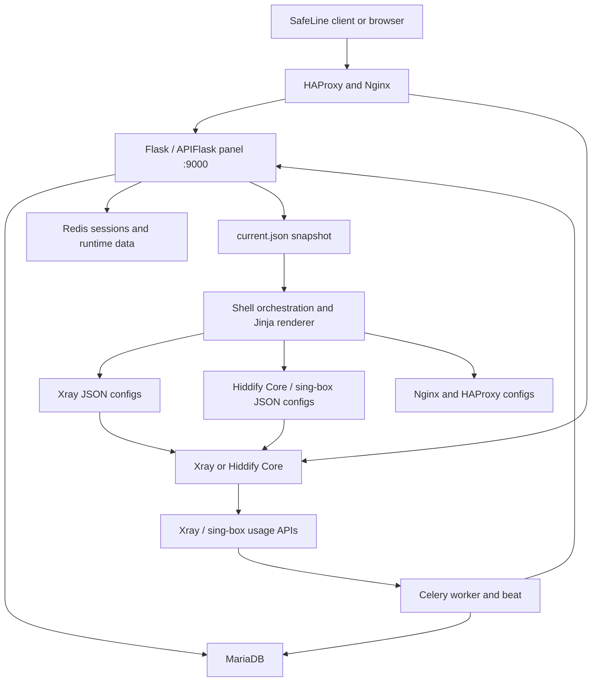

# SafeLine Manager architecture audit

Audit date: 2026-08-13

Baseline: Hiddify Manager `v12.3.3` (`736aae99a68aab63568c515147a871d2723f18c7`)

Panel: Hiddify Panel `v12.3.3` (`cf2e60de038c7d658d2bf4b2d84c7b433e3c918d`)

## Executive summary

Hiddify Manager is not a single web application. It is a Linux server
orchestrator containing a Python control panel, a MariaDB database, Redis and
Celery, generated Xray/Hiddify Core configurations, and an Nginx/HAProxy edge
layer. The Python panel owns users and settings, exports a `current.json`
snapshot, and the shell/Jinja layer turns that snapshot into runtime service
configuration.

SafeLine can reuse the mature Xray/Reality configuration and usage-accounting
path, but it should not start with a global rename. Internal identifiers such as
`/opt/hiddify-manager`, the `hiddifypanel` Python package, database names,
systemd units, and template variables are coupled across the repository.
User-visible branding can be separated first while those compatibility names
remain internal.

Three findings change the project plan:

1. The modern user portal is only present as a compiled JS/CSS bundle. Its
   editable source is a separate, unpinned repository.
2. Remote-node support is incomplete. APIs and synchronization code exist, but
   the admin model explicitly rejects remote nodes with `Remote nodes are not
   supported yet!`.
3. Licensing is mixed, and the Python panel declares a non-commercial Creative
   Commons license. Commercial use requires a formal decision before launch.

## Runtime architecture



## Repository map

| Area | Important paths | Responsibility |
| --- | --- | --- |
| Main orchestrator | `install.sh`, `apply_configs.sh`, `restart.sh`, `update.sh` | Installation, config application, service lifecycle, upstream updates |
| Shared tooling | `common/` | Package downloads, Python environment, shell helpers, configuration export and Jinja rendering |
| Python panel wrapper | `hiddify-panel/` | systemd units, application config, install/run/backup helpers |
| Python application | `hiddify-panel/src/hiddifypanel/` | Web app, API, authentication, models, usage accounting, node synchronization |
| User portal | `hiddify-panel/src/hiddifypanel/panel/user/` and `static/new/` | Subscription endpoints, profile UI template, compiled React-style frontend assets |
| Admin UI | `hiddify-panel/src/hiddifypanel/panel/admin/` | Flask-Admin/AdminLTE views for users, domains, proxies, settings and nodes |
| Xray server config | `xray/configs/` | Jinja templates for inbound, outbound, routing, policy, API and stats configuration |
| Hiddify Core config | `singbox/configs/` | Jinja templates for sing-box-derived runtime configuration |
| Edge routing | `nginx/`, `haproxy/`, `acme.sh/` | TLS, domains, paths, SNI routing, certificates and proxying |
| Optional services | `other/` | Redis, MariaDB, SSH proxy, WireGuard, Telegram proxy, WARP, DNS tunnels and deprecated components |
| Operations | `operations/` | LXD deployment helpers |

## Application startup and request routing

`hiddifypanel.base.create_app()` creates an `APIFlask` application and loads
extensions by mode:

- database and logging for all modes;
- CLI commands in CLI mode;
- request setup, common pages, admin UI, user UI, REST API, node API and Celery
  in web mode.

The web service runs from `hiddify-panel/app.py` under the
`hiddify-panel.service` systemd unit. The application listens on port 9000 and
is normally reached through Nginx/HAProxy, not exposed directly.

Routes use configurable secret path segments:

```text
/<admin_proxy_path>/...
/<client_proxy_path>/<user_uuid>/...
```

The same application registers admin, client, API v1, API v2, parent/child and
panel blueprints.

## Data model

| Model | Purpose | SafeLine relevance |
| --- | --- | --- |
| `AdminUser` | Owner/admin/agent hierarchy and user limits | Can remain an internal operator model initially |
| `User` | UUID, quota, package duration, start date, usage, enabled state, Telegram ID and protocol keys | Core VPN account record; suitable as the first adapter target |
| `UserDetail` | Per-child usage/device placeholder | Currently underused; not a reliable node-usage ledger |
| `DailyUsage` | Aggregated usage and online counts per admin and child | Useful for dashboards, insufficient for billing-grade events |
| `Domain` | Public domains, modes, CDN/reality metadata and node association | Core routing input |
| `Proxy` | Protocol, transport, security layer, CDN mode and parameters | Drives subscription and server template generation |
| `Child` | Local virtual child, remote child or parent identity | Basis for nodes, but remote operation is unfinished |
| `BoolConfig` / `StrConfig` | Per-child application settings | Large, coupled configuration surface |

`User.is_active` is derived from `enable`, quota consumption and remaining
package days. There are no first-class plan, tariff, subscription, invoice,
payment, entitlement, or node-health models. Those are SafeLine product
features, not simple renames of existing fields.

## API surface

Authentication currently accepts a `Hiddify-API-Key` header. In practice the
key is an administrator/user UUID, and node calls use a node `unique_id`. The
same UUID can also appear in a secret URL. SafeLine should preserve compatibility
temporarily but must introduce scoped, revocable credentials before exposing an
API to a production bot.

| Prefix | Main operations |
| --- | --- |
| `/<path>/api/v2/admin/` | Current admin, server status, admin CRUD, user CRUD, logs, usage refresh, exported configs and public ports |
| `/<path>/api/v2/user/` | Profile info, available apps/configs, MTProxy data and short links |
| `/<path>/<user_uuid>/api/v2/user/` | UUID-addressed form of the user API |
| `/<path>/api/v2/panel/` | Panel information and ping/pong |
| `/<path>/api/v2/parent/` | Node registration, status, synchronization and usage ingestion |
| `/<path>/api/v2/child/` | Parent registration/sync and remote actions |
| `/<path>/api/v1/` | Legacy Telegram/resource endpoints |

The admin user API already supports list, create, read, patch and delete. Each
mutation updates live core users and then triggers `apply_users`. This is the
best existing seam for an early Telegram-bot integration, behind a SafeLine
adapter that adds idempotency, authorization and audit logging.

## User subscriptions and frontend

`panel/user/user.py` selects output by user agent and exposes:

- plain and Base64 subscription links;
- Xray JSON;
- Hiddify Core/sing-box JSON;
- Clash and Clash Meta;
- WireGuard;
- browser profile UI.

The browser page is `panel/user/templates/new.html`. It loads the compiled
`static/new/assets/index-ccb9873c.js` bundle and obtains profile/config data
from the user API. The release has no package manifest, source tree or source
map for that bundle. The provided `get_new.sh` script pulls an unpinned
`gh-pages` build from a different repository.

SafeLine should replace this delivery path with:

1. a SafeLine-owned frontend source directory or repository;
2. a locked dependency manifest;
3. a reproducible build that emits hashed assets plus a generated manifest;
4. a small server template that reads the manifest instead of hard-coding a
   bundle filename;
5. API contracts covered by tests.

## Configuration generation and usage accounting

The control flow for a full configuration application is:

1. `install.sh` starts or updates required services.
2. `reload_all_configs` calls the local admin API, falling back to the CLI.
3. The panel's `all_configs_for_cli()` exports active users, domains and
   per-child settings into `/opt/hiddify-manager/current.json`.
4. `common/replace_variables.sh` invokes `common/jinja.py`.
5. Jinja renders all `.j2` templates outside the panel source tree.
6. Xray, Hiddify Core, Nginx, HAProxy and optional services reload or restart.

For usage accounting, Celery calls drivers for Xray, Hiddify Core, SSH,
WireGuard and Telegram proxy. Usage is written to users and daily aggregates;
accounts that cross quota or expiry boundaries are added to or removed from
runtime cores.

This path is valuable and should be protected by characterization tests before
protocol removal or schema changes.

## Installation and release behavior

The primary target is a privileged Linux host using `/opt/hiddify-manager`,
systemd, MariaDB, Redis and root-owned network services. The Windows checkout is
suitable for source inspection and static checks, not an end-to-end runtime.

Production reproducibility is currently weak:

- updater URLs point directly to Hiddify GitHub releases and branches;
- some components use `latest` container tags;
- the frontend helper pulls an unpinned branch;
- package selection can choose the latest entry when no version is supplied;
- Xray and sing-box validation commands are present but deliberately skipped;
- the panel's `make test` and lint targets only print `skip`;
- there is no substantive automated test suite.

SafeLine needs its own artifact registry, pinned dependency manifest, release
signing/checksums, rollback procedure and clean-VPS installation test.

## Node-management assessment

The codebase contains parent/child schemas, APIs, synchronization clients and
per-child settings. However, it is not a finished multi-node control plane:

- the admin UI rejects newly created remote nodes;
- `UserDetail` does not provide dependable per-node accounting;
- node HTTP calls have no explicit timeout;
- synchronization mixes users, admins, domains, proxies, settings and usage;
- health state, heartbeats, draining and rollout state are absent;
- authorization uses shared UUID-like identifiers rather than scoped node
  credentials.

SafeLine node management should therefore be treated as a new subsystem built
around selected synchronization primitives, not as an already complete feature
that only needs rebranding.

## Risk register

### Blocking before a paid launch

- Resolve the mixed GPL/CC0/CC BY-NC-SA licensing and third-party asset terms.
- Replace or obtain a reproducible source for the user frontend.
- Move updates and artifacts to SafeLine-controlled, pinned release channels.
- Define a supported Linux distribution and test clean installation/rollback.

### High-priority security debt

- Flask secret key is hard-coded in source.
- Passwords are stored and compared as plain text.
- account UUIDs act as API credentials and appear in URLs;
- Docker runs privileged and uses unpinned images;
- Xray and Hiddify Core run as root;
- the MariaDB setup grants the panel user privileges on `*.*`;
- generated core configurations are not validated before reload;
- node requests do not set timeouts or use scoped credentials.

These findings are an initial architecture/security inventory, not a complete
penetration test.

## SafeLine reuse decision

| Area | Initial decision |
| --- | --- |
| Xray/Reality server templates | Keep and characterize before changing |
| Usage drivers | Keep, test, then simplify to supported cores |
| User/domain/proxy models | Keep behind a SafeLine service layer initially |
| Admin UI | Keep as an internal fallback while a minimal SafeLine admin is built |
| Compiled user portal | Replace with reproducible SafeLine frontend source |
| Authentication/API keys | Compatibility only; design a new credential model |
| Installer/updater | Fork early and point only to SafeLine artifacts |
| Optional protocols/services | Disable first; remove only after dependency tests |
| Remote node management | Redesign as a SafeLine subsystem |
| Billing/tariffs/payments | Add as new SafeLine domain models/services |

## Verification performed

- Outer repository resolves exactly to Manager tag `v12.3.3`.
- Panel submodule resolves exactly to Panel tag `v12.3.3`.
- The outer worktree and panel checkout were clean before audit documents were
  added.
- 152 Python files under the application and shared tooling parsed successfully
  with Python 3.12 (`ast.parse`); no syntax errors were found.
- Full runtime, installer, database, Xray and Hiddify Core tests were not run
  because they require the privileged Linux deployment environment and the
  upstream project does not provide a functional local automated test suite.
